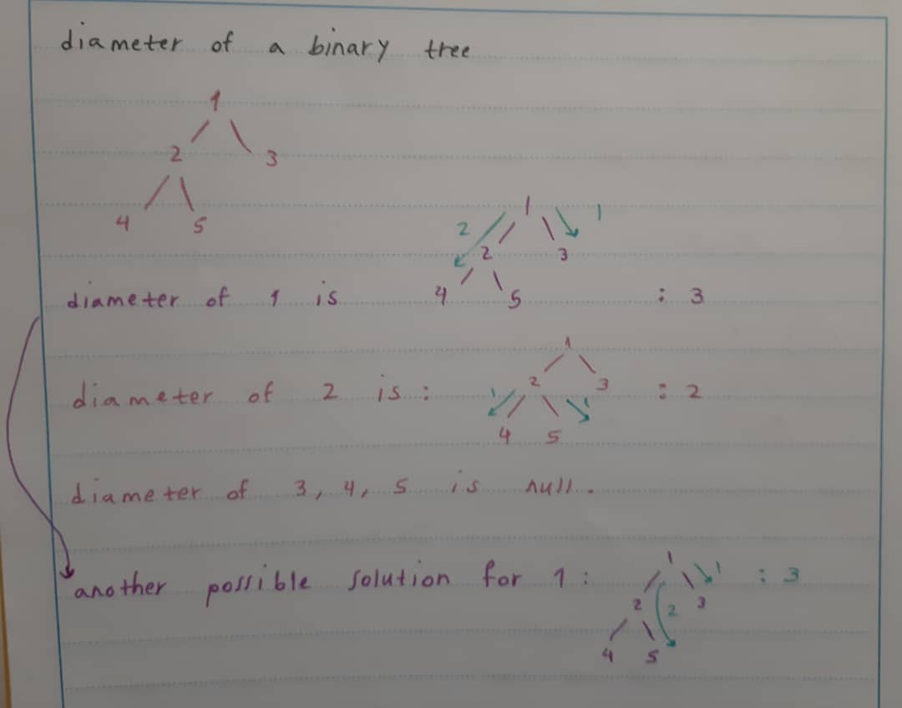

<h1>Diameter of a Binary Tree</h1>

we're gonna calculate the height and the diameter of each node, starting from the bottom, the height and diameter of 5 is : 0 , 0

 

** the height of a single node is 0

going up, the height and diameter of 4 is 0 , 2 ! how can we calculate the height and the diameter ? the height is <b>max(Hl + Hr) + 1</b> and the diameter is <b>Hl + Hr + 2</b>

 

** the height of a null node is -1